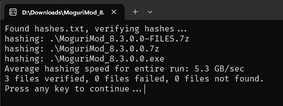

## folder_hasher

this is a very simple utility to hash every file in the current folder and all subfolders

hashing algorithm used: XXH3-128 (XXH128)

if you run folder_hasher and hashes.txt doesn't exist:

it will hash every file in current folder and all subfolders and save the hashes in hashes.txt

if you run folder_hasher and hashes.txt does exist:

it will check the hashes listed in hashes.txt and show the results

it does literally nothing else.  you can't choose the hashing algorithm or configure anything.

i wrote this really quickly for myself because i needed it.

## Features

fancy progress bars
